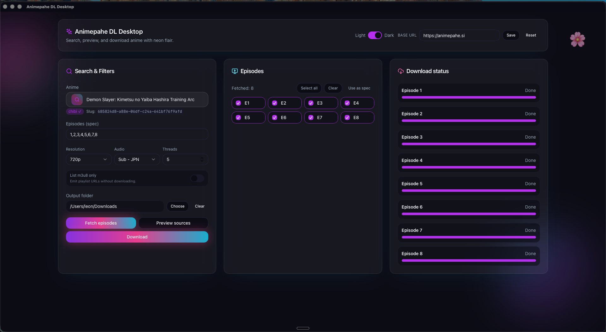

# Animepahe DL Desktop

Animepahe DL Desktop is now a Tauri + React application with a Rust backend. It modernises the original `animepahe-dl.sh` experience, keeping the fast downloader pipeline while delivering a polished desktop UI. This GUI is heavily based on the excellent CLI tool [KevCui/animepahe-dl](https://github.com/KevCui/animepahe-dl/), reusing its ergonomics while layering on a desktop-first experience.



## Highlights

- 🔍 Guided discovery: search Animepahe, review matches, and apply slugs instantly.
- 🎯 Precision controls: filter by resolution/audio, enter specs (`1,3-5,*`), or tick episodes from a checklist.
- 📦 Source preview modal: inspect audio/resolution blends before downloading.
- 🚀 Robust pipeline: ffmpeg single-thread mode with stderr progress plus multi-thread segment download/decrypt/concat.
- 🗂️ Persistent settings: theme, base URL, and download folder stored in the OS config dir.
- 🛠️ CI-ready: GitHub Actions produces installers/archives for macOS, Windows, and Linux.

## Tech Stack

- React 18 + Vite front end bundled inside a Tauri shell
- Tailwind CSS and shadcn/ui (Radix primitives) for styling and components
- Neon-glassmorphism desktop UI with gradient accents and vector icons
- Rust 2021 backend with `tokio`, `reqwest`, `scraper`, and `regex`
- macOS crash fix via `winit` ≥ 0.30.12 and `objc2` + `objc2-foundation` built with the `relax-sign-encoding` feature
- External binaries: `ffmpeg`, `node` (detected at runtime)

## Prerequisites

Install on your machine before building:

- [Rust toolchain](https://rustup.rs/) (stable channel)
- [Node.js](https://nodejs.org/) 18+ and npm/pnpm/yarn
- [ffmpeg](https://ffmpeg.org/)

### Detailed Installation Guides

For detailed, OS-specific installation instructions for each requirement:

- **[Node.js Installation Guide](requirements/NodeJS.md)** - Required for the React/Vite build tooling during development
- **[FFmpeg Installation Guide](requirements/FFMPEG.md)** - Required for video processing
- **[OpenSSL Installation Guide](requirements/OpenSSL.md)** - Required for encrypted content (multi-threaded downloads only)

At runtime the desktop app only depends on `ffmpeg`; Node.js is needed solely for local development/build steps.

## Quick Start

```bash
git clone https://github.com/<your-account>/animepahe-dl.git
cd animepahe-dl
npm install # installs tailwind, shadcn/ui dependencies, radix primitives
npm run tauri dev
```

This spins up the Vite dev server with hot reload inside the Tauri shell.

### Build & Package

```bash
npm run build          # bundles the React front end
npm run tauri build    # produces installers/archives per platform
```

Output goes to `src-tauri/target/release/` (DMG/ZIP on macOS, MSI/EXE on Windows, AppImage/deb/tar on Linux depending on target).

### Backend-only

```bash
cargo fmt -p animepahe-tauri
cargo check -p animepahe-tauri --locked
cargo build -p animepahe-tauri --release --locked
```

## Using the App

1. **Search** – enter a title and click “Search”.
2. **Apply** – select a result to fill the slug automatically.
3. **Fetch** – pull the episode catalogue, then tick entries or type a spec (`1,3-5,*`).
4. **Preview** – open “Preview sources” to inspect audio/resolution streams.
5. **Download** – adjust threads, choose the output folder, and start. Progress events stream live to the UI.

Theme, base URL, and output directory are editable on the toolbar and persist between runs.

## Packaging & Releases

- `npm run tauri build` bundles the front end and emits cross-platform artifacts.
- The GitHub workflow in `.github/workflows/release.yml` builds Linux `.tar.gz`, macOS `.zip`, and Windows `.zip` artifacts when triggered via `v*` tags or the “Run workflow” button.

## Development Checklist

```bash
cargo fmt -p animepahe-tauri
cargo check -p animepahe-tauri --locked
npm run lint   # add ESLint/Prettier if desired
```

## License

MIT – see [`LICENSE`](LICENSE).
