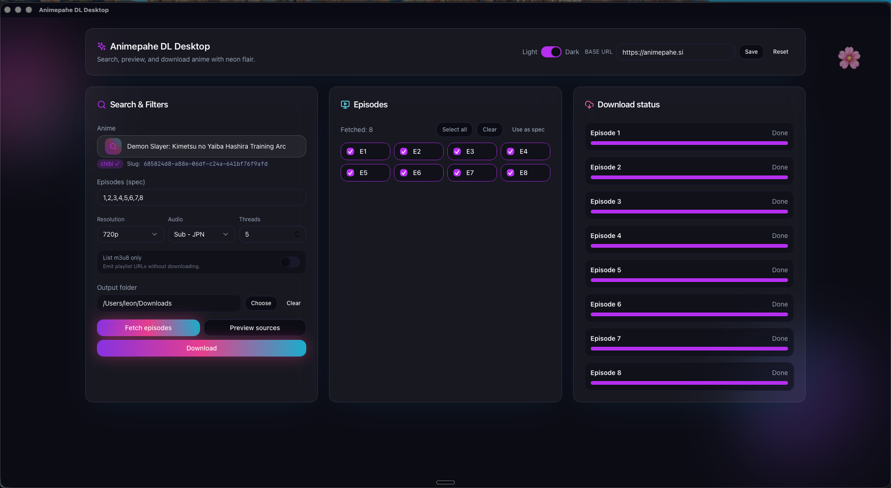

# Animepahe DL Desktop

Animepahe DL Desktop is now a Tauri + React application with a Rust backend. It modernises the original `animepahe-dl.sh` experience, keeping the fast downloader pipeline while delivering a polished desktop UI. This GUI is heavily based on the excellent CLI tool [KevCui/animepahe-dl](https://github.com/KevCui/animepahe-dl/), reusing its ergonomics while layering on a desktop-first experience.



## Highlights

- 🔍 **Universal Navigation**: Screen-based architecture with 8 core screens (Home, Search, Title, Episodes, Player, Downloads, Library, Settings) connected via React Router
- 📱 **Responsive Design**: Adaptive UI with mobile bottom navigation and desktop horizontal header, both featuring automatic back button detection
- 🎬 **Integrated Video Player**: Built-in player supporting both local library files and remote HLS streaming with quality selection
- 📚 **Library Management**: Track downloaded episodes, watch history, and manage your local collection
- 🎯 **Smart Episode Selection**: Pattern-based episode selection (ranges, latest N, specific episodes) with batch download support
- 🚀 **Robust Download Pipeline**: Multi-threaded downloads with progress tracking, queue management, and automatic resume
- 🔄 **State Persistence**: Zustand-based stores with persistence for preferences, library, player settings, and download queue
- 🛠️ **CI-ready**: GitHub Actions produces installers/archives for macOS, Windows, and Linux

## Tech Stack

- React 18 + Vite front end bundled inside a Tauri shell
- Tailwind CSS and shadcn/ui (Radix primitives) for styling and components
- Neon-glassmorphism desktop UI with gradient accents and vector icons
- Rust 2021 backend with `tokio`, `reqwest`, `scraper`, and `regex`
- Embedded JavaScript evaluation via pure-Rust `boa_engine` for playlist deobfuscation across macOS/Windows/Linux
- macOS crash fix via `winit` ≥ 0.30.12 and `objc2` + `objc2-foundation` built with the `relax-sign-encoding` feature
- External binaries: `ffmpeg`, `node` (detected at runtime)

## Prerequisites

Install on your machine before building:

- [Rust toolchain](https://rustup.rs/) (stable channel)
- [Node.js](https://nodejs.org/) 18+ and npm/pnpm/yarn
- [ffmpeg](https://ffmpeg.org/)

### Detailed Installation Guides

For detailed, OS-specific installation instructions for each requirement:

- **[Node.js Installation Guide](requirements/NodeJS.md)** - Required for the React/Vite build tooling during development
- **[FFmpeg Installation Guide](requirements/FFMPEG.md)** - Required for video processing

At runtime the desktop app only depends on `ffmpeg`; Node.js is needed solely for local development/build steps.

### Bundled ffmpeg binaries

The Tauri bundle looks for a platform-specific `ffmpeg` executable under `src-tauri/resources/ffmpeg/<platform>/` (copied into the app bundle at build time):

- macOS: `src-tauri/resources/ffmpeg/macos/ffmpeg`
- Windows: `src-tauri/resources/ffmpeg/windows/ffmpeg.exe`
- Linux: `src-tauri/resources/ffmpeg/linux/ffmpeg`

If you place the appropriate binary in these folders before running `npm run tauri build`, the packaged app will prefer the bundled copy. When the folder is empty the app automatically falls back to the system `ffmpeg` on `PATH`.

## Quick Start

```bash
git clone https://github.com/<your-account>/animepahe-dl.git
cd animepahe-dl
npm install # installs tailwind, shadcn/ui dependencies, radix primitives
npm run tauri dev
```

This spins up the Vite dev server with hot reload inside the Tauri shell.

### Build & Package

```bash
npm run build          # bundles the React front end
npm run tauri build    # produces installers/archives per platform
```

Output goes to `src-tauri/target/release/` (DMG/ZIP on macOS, MSI/EXE on Windows, AppImage/deb/tar on Linux depending on target).

### Backend-only

```bash
cargo fmt -p animepahe-tauri
cargo check -p animepahe-tauri --locked
cargo build -p animepahe-tauri --release --locked
```

## Using the App

### Main Screens

1. **Home Screen** – Dashboard with recently watched episodes and quick access to trending content
2. **Search Screen** – Search for anime titles with instant results and navigation to title details
3. **Title Screen** – View anime details, synopsis, and episode grid with play/download options
4. **Episodes Screen** – Select episodes using patterns (e.g., `1-5`, `latest 10`, `all`) and batch download
5. **Player Screen** – Watch episodes locally or stream remotely with quality/audio selection and episode navigation
6. **Downloads Screen** – Monitor active downloads, view queue, and manage download progress
7. **Library Screen** – Browse downloaded episodes, continue watching, and manage your collection
8. **Settings Screen** – Configure download directory, host URL, thread count, and app preferences

### Navigation

- **Mobile**: Bottom navigation bar with Home, Search, Downloads, Library, and Settings tabs. Automatic back button appears in the top bar for nested routes.
- **Desktop**: Horizontal header navigation with the same 5 sections. Back button automatically shows before the logo for nested routes (e.g., viewing a specific title or episode list).

### Workflow

1. **Discover** – Search for anime on the Search screen or browse trending titles on Home
2. **Explore** – View anime details on the Title screen with synopsis, metadata, and episode previews
3. **Select** – Navigate to Episodes screen to select specific episodes using patterns or checkboxes
4. **Download** – Choose quality/audio options and download to your configured directory
5. **Watch** – Play episodes directly from the Library or Title screen, either locally or via streaming
6. **Track** – Your watch history and progress are automatically saved across sessions

### Download State Persistence

All download progress is automatically tracked and saved to `~/.config/animepahe-dl/download_state.json` (or equivalent OS config directory). This includes:

- Download status (in-progress, completed, failed, cancelled)
- Progress tracking (downloaded bytes, file size, timestamps)
- Episode metadata (anime name, slug, audio/resolution settings)
- Error messages for failed downloads

The app automatically detects incomplete downloads on startup and offers to resume them. You can also manually access the resume dialog via the toolbar button.

## Analytics & Privacy

Animepahe DL Desktop includes **optional, privacy-conscious analytics** to help us improve the app. Analytics are **enabled by default** but can be disabled at any time.

### What We Track

We collect **anonymous usage data** to understand how the app is used and identify areas for improvement:

- **User Actions**: Search, selection, and download events (counts and durations only)
- **App Usage**: Launch, session duration, settings changes
- **Feature Usage**: Tour interactions, requirements checks
- **Performance**: Search speed, download speed, startup time (all categorized)
- **Errors**: Error types only (no messages, stack traces, or personal data)

### What We DON'T Track

We take your privacy seriously and **never collect**:

- ❌ Anime titles or search queries
- ❌ File names or paths
- ❌ Personal information
- ❌ IP addresses (PostHog anonymization)
- ❌ Exact error messages or stack traces
- ❌ System specifications beyond OS type

### How to Disable Analytics

**In the App:**
1. Toggle off "Share anonymous usage data" in the settings section
2. Click "View Details" to see exactly what's tracked
3. Use the Analytics Dashboard to reset your ID or clear data

**Via Environment Variables:**

Create a `.env` file in the project root:

```env
# Disable analytics completely
VITE_ENABLE_ANALYTICS=false

# Or configure PostHog (optional)
VITE_POSTHOG_KEY=your_posthog_key_here
VITE_POSTHOG_HOST=https://app.posthog.com
```

**For Developers:**

If you're building from source, analytics are automatically disabled in development mode unless explicitly configured.

### Learn More

For complete details about data collection and your rights:
- View the [Privacy Policy](PRIVACY.md)
- Check the in-app Analytics Dashboard (Settings → View Details)

## Packaging & Releases

- `npm run tauri build` bundles the front end and emits cross-platform artifacts.
- The GitHub workflow in `.github/workflows/release.yml` runs on pushes to the `release` branch, builds installers for macOS (Intel + Apple Silicon), Windows, and Linux, and drafts the corresponding GitHub Release.

## Development Checklist

```bash
cargo fmt -p animepahe-tauri
cargo check -p animepahe-tauri --locked
npm run lint   # add ESLint/Prettier if desired
```

## License

MIT – see [`LICENSE`](LICENSE).
